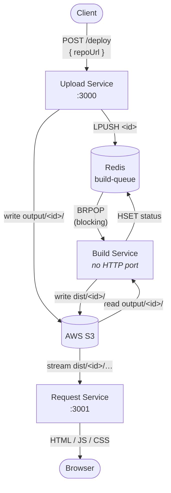
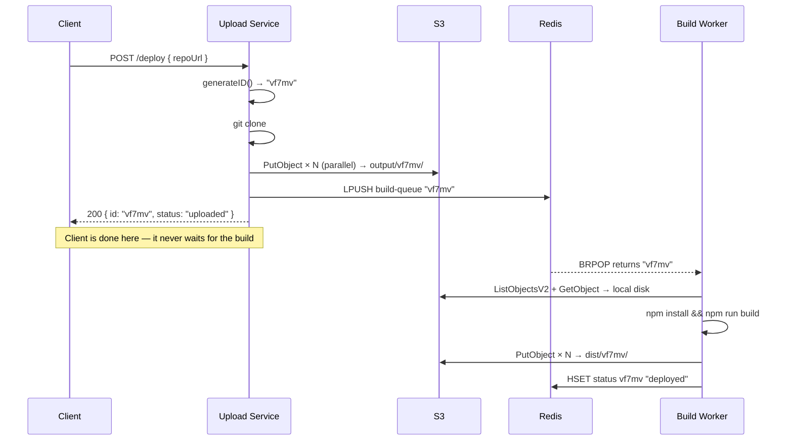

# Zenith — deploy a static site from a GitHub URL

Zenith is a deployment platform in the shape of a minimal Vercel. You `POST` a
GitHub repository URL and get a project ID back immediately; a background worker
clones the repo, builds it, and pushes the artifacts to S3, and the site goes
live at `<project-id>.yourdomain.com`.

It is three independent Node/TypeScript services that **never call each other**.
The only things holding the system together are a Redis queue and an S3 key
convention — which is what makes the build workers scalable and a Redis outage
survivable.

🔗 **Demo Video:** [Watch on Google Drive](https://drive.google.com/file/d/1k1Eu60vR_z3x7omq-2VDyS0RY70C56P0/view?usp=sharing)

---

## The idea in one picture


```mermaid
flowchart TB
    Client(["Client"]) -->|"POST /deploy<br/>{ repoUrl }"| UP["Upload Service<br/>:3000"]
    UP -->|"LPUSH &lt;id&gt;"| R[("Redis<br/>build-queue")]
    R -->|"BRPOP<br/>(blocking)"| B["Build Service<br/><i>no HTTP port</i>"]
    B -->|"HSET status"| R
    UP -->|"write output/&lt;id&gt;/"| S3[("AWS S3")]
    S3 -->|"read output/&lt;id&gt;/"| B
    B -->|"write dist/&lt;id&gt;/"| S3
    S3 -->|"stream dist/&lt;id&gt;/…"| RQ["Request Service<br/>:3001"]
    RQ -->|"HTML / JS / CSS"| Browser(["Browser"])
```

Note that the build service has **no port**. Nothing calls it — it sits blocked
on the queue and pulls work. That single fact is the architecture: the write
path, the compute, and the read path are decoupled, so each can be scaled,
restarted, or rewritten without touching the others.

---

## What actually happens when you deploy


```mermaid
sequenceDiagram
    participant C as Client
    participant U as Upload Service
    participant S as S3
    participant R as Redis
    participant B as Build Worker

    C->>U: POST /deploy { repoUrl }
    U->>U: generateID() → "vf7mv"
    U->>U: git clone
    U->>S: PutObject × N (parallel) → output/vf7mv/
    U->>R: LPUSH build-queue "vf7mv"
    U-->>C: 200 { id: "vf7mv", status: "uploaded" }
    Note over C,U: Client is done here — it never waits for the build

    R-->>B: BRPOP returns "vf7mv"
    B->>S: ListObjectsV2 + GetObject → local disk
    B->>B: npm install && npm run build
    B->>S: PutObject × N → dist/vf7mv/
    B->>R: HSET status vf7mv "deployed"
```

The client's request completes after the clone and upload — it does **not** wait
for `npm install`, which is almost always the slowest step by a wide margin.
That asymmetry is the entire reason the queue exists. Holding an HTTP connection
open for the length of a dependency install is fragile: proxies time out,
clients retry, and a request that slow can't be load-balanced sensibly.

### The two contracts

Because no service calls another, there are exactly two integration points:

| Contract              | Shape                                               | Producer → Consumer             |
| :-------------------- | :-------------------------------------------------- | :------------------------------ |
| **Redis queue**       | List `build-queue`, elements are bare project IDs   | Upload → Build                  |
| **S3 key convention** | `output/<id>/…` = source, `dist/<id>/…` = artifacts | Upload → Build, Build → Request |

Keeping source and artifacts under separate prefixes is deliberate: the request
service must never be able to serve raw repository source, and a prefix split
makes that enforceable with an IAM policy rather than with careful coding.

---

## The three services

| Service                              | Port | Role                                                                                                         |
| :----------------------------------- | :--- | :----------------------------------------------------------------------------------------------------------- |
| **Upload** (`apps/upload-service`)   | 3000 | HTTP entry point. Mints an ID, clones the repo, uploads source to S3, enqueues the job, returns the ID.      |
| **Build** (`apps/build-service`)     | —    | Queue consumer. Blocks on `BRPOP`, downloads source, runs the build, uploads `dist/`, records status.        |
| **Request** (`apps/request-service`) | 3001 | Read path. Maps subdomain → S3 prefix, streams objects with the right MIME type, falls back to `index.html`. |

---

## Features

- **One-call deploy.** A single `POST` with a repo URL is the entire interface.
- **Asynchronous build pipeline.** Redis-backed job queue decouples API latency from build duration.
- **Blocking queue consumption.** `BRPOP` gives zero-latency job pickup with no polling cost.
- **Free horizontal scaling of builds.** Run N build workers; Redis hands each job to exactly one of them, with no locking or coordination code.
- **Per-project subdomain hosting.** One process serves unlimited projects, resolved from the `Host` header.
- **SPA fallback routing.** Deep links and refreshes on client-side routes resolve to `index.html`.
- **Stateless services.** All durable state is in S3 and Redis; any replica can serve any request or job.
- **Monorepo.** npm workspaces, three independently typed packages, one install.
- **Containerised.** One image, three containers, one `docker compose up`.

---

## Setup

### Prerequisites

1. **Node.js 20+**
2. **Docker & Docker Compose** (for the containerised path)
3. **An AWS S3 bucket** and an IAM user with read/write access to it
4. **A Redis instance** — Compose does _not_ start one; point at a local Redis or a managed instance

### Environment

Create a `.env` in the repository root:

```env
AWS_ACCESS_KEY_ID=your_access_key
AWS_SECRET_ACCESS_KEY=your_secret_key

# Standard Redis connection URL — redis:// or rediss://
UPSTASH_REDIS_REST_URL=redis://localhost:6379
```

### Run with Docker Compose

```bash
docker compose up -d
```

### Run locally

```bash
npm install
npm run build --workspaces
```

Then start each service in its own terminal, from the repository root:

```bash
node apps/upload-service/dist/index.js
```

```bash
node apps/build-service/dist/index.js
```

```bash
node apps/request-service/dist/index.js
```

---

## Repository map

| Path                                | Purpose                                                     |
| :---------------------------------- | :---------------------------------------------------------- |
| `apps/upload-service/src/index.ts`  | `POST /deploy`: ID generation, clone, upload, enqueue       |
| `apps/upload-service/src/aws.ts`    | S3 client and `uploadFile`                                  |
| `apps/upload-service/src/utils.ts`  | Recursive directory walker                                  |
| `apps/upload-service/src/redis.ts`  | Redis connection                                            |
| `apps/build-service/src/index.ts`   | The worker loop — `BRPOP`, build, upload, status            |
| `apps/build-service/src/aws.ts`     | `downloadS3Folder`, `copyFinalDist`                         |
| `apps/build-service/src/utils.ts`   | `buildProject` — child process wrapped in a Promise         |
| `apps/build-service/src/redis.ts`   | Two connections: one blocks on the queue, one writes status |
| `apps/request-service/src/index.ts` | Wildcard route, subdomain routing, MIME, SPA fallback       |
| `Dockerfile`                        | One image for all three services                            |
| `docker-compose.yml`                | Three containers, each overriding `command:`                |
| `docs/INTERVIEW-GUIDE.md`           | Deep architecture walkthrough and design rationale          |

---

## Design decisions

### Why a queue instead of building in the request

`npm install` dominates deploy time. Doing it inside the HTTP request means the
client holds a connection open for the whole build, which breaks on proxy
timeouts, wastes a server socket, and makes the endpoint impossible to reason
about under load. Pushing an ID onto a list and returning immediately means the
API stays fast and the build capacity becomes an independent scaling dimension.

It also buys durability: if every build worker is offline, deploys still
succeed. The jobs simply accumulate in Redis until a worker comes back.

### Why blocking `BRPOP` rather than polling

Polling with `RPOP` on a timer costs on both sides of the trade. An idle worker
still issues a request every interval, and a job pushed just after a poll waits
for the next tick before anyone notices it. `BRPOP key 0` blocks indefinitely
and Redis wakes the client the instant an element arrives — no idle cost, no
pickup latency.

It also happens to be how you scale. Run ten build workers, all blocked on the
same key, and Redis delivers each pushed element to exactly one of them. There
is no lock, no leader election, and no code change — the scaling lever is the
replica count.

### Why S3 rather than a shared volume

The services are independent processes that may not share a host, so they need
storage that requires no coordination. S3 gives durability and effectively
unlimited capacity, but the real win is that it keeps every service
**stateless**: no replica owns anything, so any of them can pick up any job, and
a container dying loses nothing but an in-flight build.

### Why the SPA fallback exists

A React Router app has one real file — `index.html` — and resolves routes in the
browser. Request `/dashboard/settings` directly, or just refresh while you're
there, and the server gets an HTTP request for a path with no corresponding
file. Without a fallback that's a 404 on every refresh, which is the classic
broken-SPA deployment. So a failed lookup serves `dist/<id>/index.html` and lets
the client router take over. If `index.html` is missing too, the project
genuinely doesn't exist and the response is a real 404.

---
